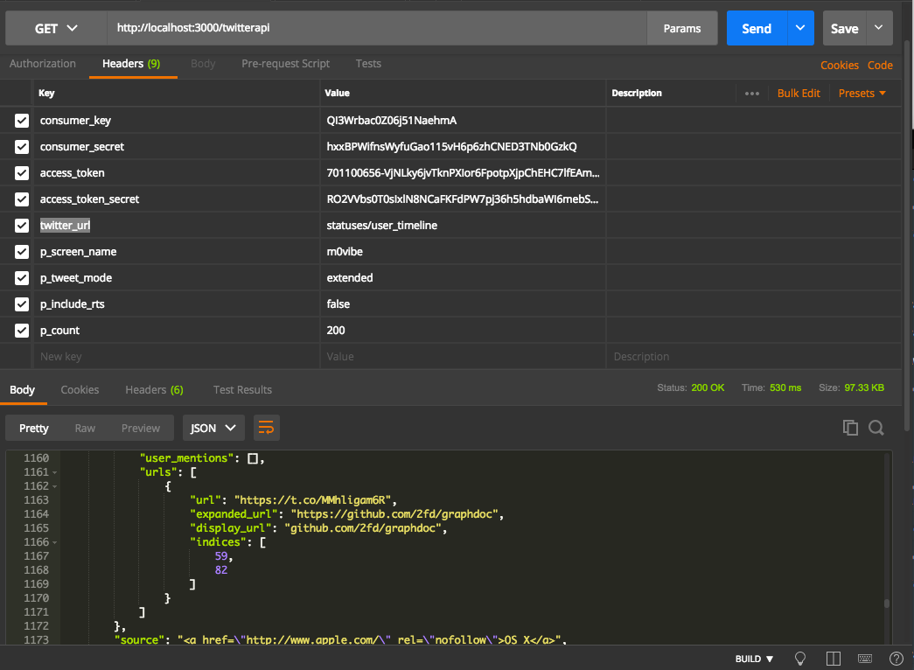

# Twitter Api Bot  
Container em express para fazer requisições vai API do twitter via request  
 
 # Rotas
 
 ## /
  Rota inicial apenas para dizer se a aplicação está pronta
 
 ## /twitterapi  

 # Header
Parâmetros obrigatórios para passar no header da requisição 

| Header | Value | Description |
|--|--| --|
| consumer_key | 12323| ConsumerKey do app | 
| consumer_secret |adf1233 | ConsumerScreet do app |
| access_token  | adf123213 | AccessToken do app |
|access_token_secret  |adfasdf123213 | AccessTokenSecret do app |
|timeout_ms | 9000  | Timeout em mile segundos|
| twitter_url| **statuses/user_timeline**| **Url da api  do Twitter**|

## Header Api Params

Parâmetros obrigatórios e opcionais dependendo da documentação da api do Twitter 
> Obs: todos os parâmetros tem que começar com p_ para separar dos outros comandos do header, depois do _p, se refere ao nome do campo que a api do twitter irá fazer consulta

### Exemplo de requisição
| Header | Value | Description |  
|--|--| --|  
| p_screen_name | m0vibe| Username |   
| p_tweet_mode |extended | Se vai vir mais de 144 caracteres |  
| p_include_rts  | true | Se vai conter retweets |  
|p_count  | 200 | Quantidade de tweets por cada consulta |  

# Screenshot

